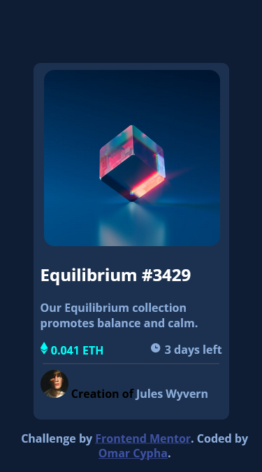
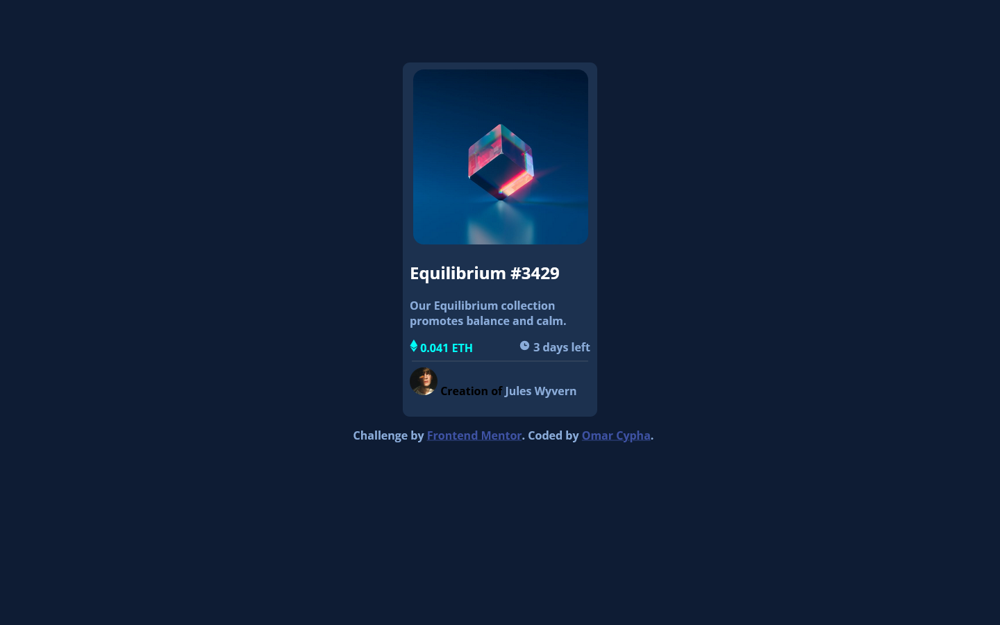

# Frontend Mentor - NFT preview card component solution

## Welcome! 👋

### This is a solution to the [NFT preview card component challenge on Frontend Mentor](https://www.frontendmentor.io/challenges/nft-preview-card-component-SbdUL_w0U).

### Built with
- Semantic HTML5 markup
- CSS custom properties

## Deployed with 
 [Netlify](https://www.netlify.com/)


## Screenshot

### Mobile View



### Desktop View


### Links

- Live Site URL: [Live site](https://nftcypha.netlify.app/)
- Solution URL: [Solution in Github](https://github.com/OmarCypha700/NFT-preview-component)

### Deployed with
- Netlify

## What I learned

How to create and image overlay with css

See below:

```css
.overlay{
    position: absolute;
    top: 0;
    bottom: 0;
    left: 0;
    right: 0;
    height: 95%;
    width: 90%;
    margin-left: 15px;
    margin-top: 10px;
    opacity: 0;
    transition: .3s ease;
    border-radius:10PX ;
    background-color:#00FFF8;
}

.nft_img:hover .overlay{
    opacity:0.7;
}

.nft_img:hover{
    opacity:0.95;
}
```

**Note:** I will be redesigning these challenges with **Figma** check them out on my [Twitter](https://www.twitter.com/OmarCypha) page.

## Author
- Github - [@Omarcypha700](https://github.com/OmarCypha700)
- Frontend Mentor - [@OmarCypha700](https://www.frontendmentor.io/profile/OmarCypha700)
- Twitter - [@OmarCypha](https://www.twitter.com/OmarCypha)